# Clean Architecture

This document describes the high-level backend structure of Mini Jira API.

The project follows Clean Architecture principles: dependencies point inward, and the Domain layer stays independent from frameworks, databases, and delivery mechanisms.

```mermaid
flowchart TB
    subgraph Domain["MiniJiraApi.Domain"]
        D1["Common<br/>BaseEntity"]
        D2["Entities<br/>User<br/>Board<br/>Column<br/>Card"]
        D3["Enums<br/>CardPriority"]
        D4["ValueObjects<br/>planned"]
        D5["Exceptions<br/>planned"]
    end

    subgraph Application["MiniJiraApi.Application"]
        A1["Features<br/>Auth<br/>Boards<br/>Columns<br/>Cards"]
        A2["CQRS<br/>Commands<br/>Queries<br/>Handlers"]
        A3["Abstractions<br/>Persistence<br/>Auth<br/>Services"]
        A4["Validation<br/>FluentValidation<br/>Pipeline Behaviors"]
        A5["Mapping<br/>DTOs / Profiles"]
    end

    subgraph Infrastructure["MiniJiraApi.Infrastructure"]
        I1["Persistence<br/>AppDbContext<br/>Configurations<br/>Migrations"]
        I2["Repositories<br/>UserRepository<br/>BoardRepository<br/>UnitOfWork"]
        I3["Auth Services<br/>JwtTokenService<br/>PasswordHasher"]
        I4["DependencyInjection.cs"]
    end

    subgraph API["MiniJiraApi.API"]
        P1["Controllers<br/>AuthController<br/>BoardsController<br/>ColumnsController<br/>CardsController"]
        P2["Middleware<br/>Exception Handling<br/>Request Logging"]
        P3["Extensions<br/>Swagger<br/>Authentication<br/>CORS"]
        P4["Program.cs<br/>DI root"]
        P5["appsettings.json<br/>ConnectionStrings<br/>JwtSettings"]
    end

    API --> Application
    API --> Infrastructure
    Infrastructure --> Application
    Infrastructure --> Domain
    Application --> Domain
```



## Dependency Rule

```txt
Domain has no dependencies.
Application depends on Domain.
Infrastructure depends on Application and Domain.
API depends on Application and Infrastructure.
```

## Layer Responsibilities

```txt
Domain:
Core business model and rules. No EF Core, no ASP.NET Core, no external services.

Application:
Use cases of the system. CQRS commands, queries, handlers, validation, DTOs, and abstractions.

Infrastructure:
Technical implementations. EF Core, PostgreSQL, repositories, JWT generation, password hashing.

API:
HTTP entry point. Controllers, middleware, authentication setup, Swagger, and dependency composition.
```

## Important Rule

Application defines what it needs through interfaces.  
Infrastructure implements those interfaces.

Example:

```txt
Application/Abstractions/Auth/ITokenService.cs
Infrastructure/Auth/JwtTokenService.cs
```

This keeps business logic independent from implementation details.