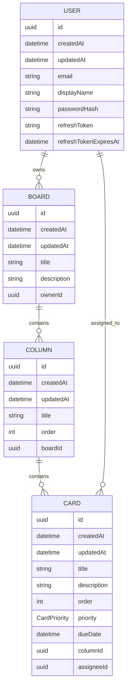
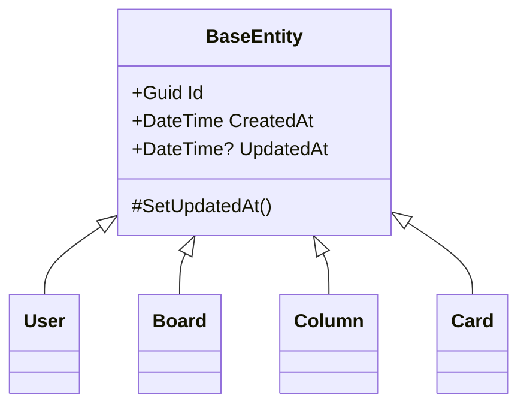
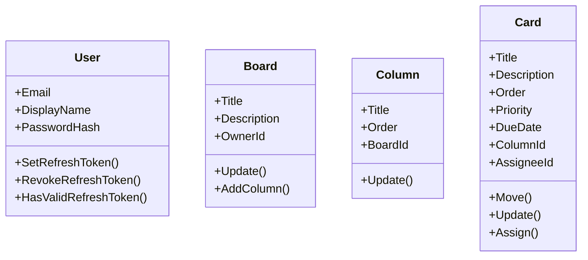

# Domain Model

This diagram describes the core business entities of Mini Jira.

The Domain layer contains the main business objects and their relationships.  
It does not depend on EF Core, ASP.NET Core, database configuration, DTOs, or API contracts.



## Relationships

```txt
User 1 -> many Boards
Board 1 -> many Columns
Column 1 -> many Cards
User 1 -> many assigned Cards
```

## Shared Entity Fields

All domain entities inherit from `BaseEntity`.



## Entity Responsibilities

